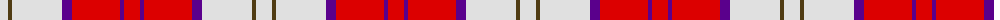

The parent of this is [MacGiboney (Personal)](/tartans/ln/16/t4/ln50/p10/r48/p4/r/16/)

This was sourced from register-of-tartans.  It is a [7 stripes tartan](/stripes/stripes7/).

Original link https://www.tartanregister.gov.uk/tartanDetails.aspx?ref=5369

## Thread count
LN/16 T4 LN50 P10 R48 P4 R/16

## Palette
Each colour and its ΔE from the base-6 reference it is a variant of.

| Colour | Shade | Base | ΔE (OKLab) |
|---|---|---|---|
| LN |  `#E0E0E0` | W  | 0.06 |
| P |  `#5A008C` | B  | 0.12 |
| R |  `#DC0000` | R  | 0.04 |
| T |  `#503C14` | G  | 0.15 |

# Sample pattern

ID: /variants/ln/16/t4/ln50/p10/r48/p4/r/16-lne0e0e0-p5a008c-rdc0000-t503c14/
