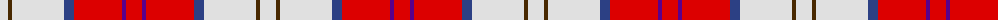
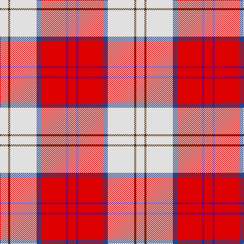

The parent of this is [Lennox Dress](/tartans/ln/16/t4/ln52/b10/r48/p4/r/16/)

This was sourced from register-of-tartans.  It is a [7 stripes tartan](/stripes/stripes7/).

Original link https://www.tartanregister.gov.uk/tartanDetails.aspx?ref=2097

## Thread count
LN/16 T4 LN52 B10 R48 P4 R/16

## Palette
Each colour and its ΔE from the base-6 reference it is a variant of.

| Colour | Shade | Base | ΔE (OKLab) |
|---|---|---|---|
| B |  `#2C4084` | B  | 0.00 |
| LN |  `#E0E0E0` | W  | 0.06 |
| P |  `#5A008C` | B  | 0.12 |
| R |  `#DC0000` | R  | 0.04 |
| T |  `#482800` | G  | 0.19 |

# Sample pattern

ID: /variants/ln/16/t4/ln52/b10/r48/p4/r/16-b2c4084-lne0e0e0-p5a008c-rdc0000-t482800/
