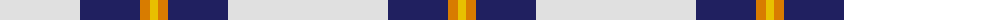
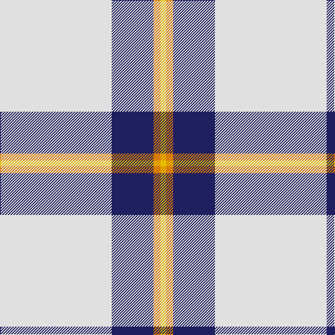

The parent of this is [Tarbh Deargh (Red Bull) (Corporate)](/tartans/ln/160/db60/o10/y/8/)

This was sourced from tartans-authority.  It is a [4 stripes tartan](/stripes/stripes4/).

Original link http://www.tartansauthority.com/tartan-ferret/display/3974/

## Thread count
LN/160 DB60 O10 Y/8

## Palette
Each colour and its ΔE from the base-6 reference it is a variant of.

| Colour | Shade | Base | ΔE (OKLab) |
|---|---|---|---|
| DB |  `#202060` | B  | 0.11 |
| LN |  `#E0E0E0` | W  | 0.06 |
| O |  `#D87C00` | Y  | 0.17 |
| Y |  `#E8C000` | Y  | 0.00 |

# Sample pattern

ID: /variants/ln/160/db60/o10/y/8-db202060-lne0e0e0-od87c00-ye8c000/
