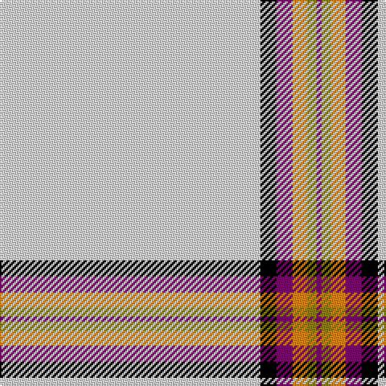

The parent of this is [Young, Christina](/tartans/ln/162/k10/p10/o9/lg6/p/3/)

This was sourced from weddslist.  It is a [6 stripes tartan](/stripes/stripes6/).

Original link http://www.weddslist.com/cgi-bin/tartans/pg.pl?source=sts

## Thread count
LN/162 K10 P10 O9 LG6 P/3

## Palette
Each colour and its ΔE from the base-6 reference it is a variant of.

| Colour | Shade | Base | ΔE (OKLab) |
|---|---|---|---|
| K |  `#000000` | K  | 0.00 |
| LG |  `#908000` | G  | 0.19 |
| LN |  `#E0E0E0` | W  | 0.06 |
| O |  `#FF8500` | Y  | 0.14 |
| P |  `#800070` | B  | 0.17 |

# Sample pattern

ID: /variants/ln/162/k10/p10/o9/lg6/p/3-k000000-lg908000-lne0e0e0-off8500-p800070/
