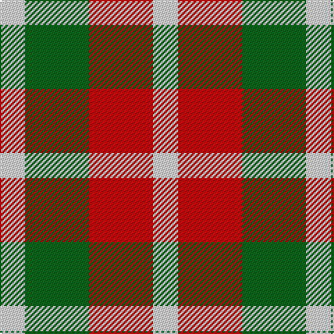

The parent of this is [Quaboos Pipers Plaid Regimental Tartan Tartan Number: 1806. Earliest known date: 1983 The Sultan of Oman is the ruler of Quaboos. See products available Copyright © Blair Urquhart, Comrie, 2015](/tartans/ln/18/g46/r46/ln/18/)

This was sourced from house-of-tartan.  It is a [4 stripes tartan](/stripes/stripes4/).

Original link http://www.house-of-tartan.scotland.net/house/TartanViewjs.asp?colr=Def&tnam=1806

## Thread count
LN/18 G46 R46 LN/18

## Palette
Each colour and its ΔE from the base-6 reference it is a variant of.

| Colour | Shade | Base | ΔE (OKLab) |
|---|---|---|---|
| G |  `#006818` | G  | 0.02 |
| LN |  `#E0E0E0` | W  | 0.06 |
| R |  `#C80000` | R  | 0.00 |

# Sample pattern

ID: /variants/ln/18/g46/r46/ln/18-g006818-lne0e0e0-rc80000/
