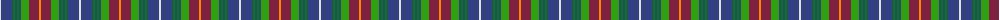

The parent of this is [McLion](/tartans/ln/2/b12/ga2/b2/ga2/b2/g8/dr10/o/2/)

This was sourced from weddslist.  It is a [9 stripes tartan](/stripes/stripes9/).

Original link http://www.weddslist.com/cgi-bin/tartans/pg.pl?source=sts

## Thread count
LN/2 B12 Ga2 B2 Ga2 B2 G8 DR10 O/2

## Palette
Each colour and its ΔE from the base-6 reference it is a variant of.

| Colour | Shade | Base | ΔE (OKLab) |
|---|---|---|---|
| B |  `#304080` | B  | 0.01 |
| DR |  `#802040` | R  | 0.16 |
| G |  `#30A010` | G  | 0.19 |
| Ga |  `#008000` | G  | 0.09 |
| LN |  `#E0E0E0` | W  | 0.06 |
| O |  `#FF8500` | Y  | 0.14 |

ID: /variants/ln/2/b12/ga2/b2/ga2/b2/g8/dr10/o/2-b304080-dr802040-g30a010-ga008000-lne0e0e0-off8500/
