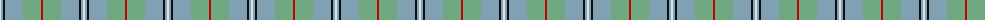
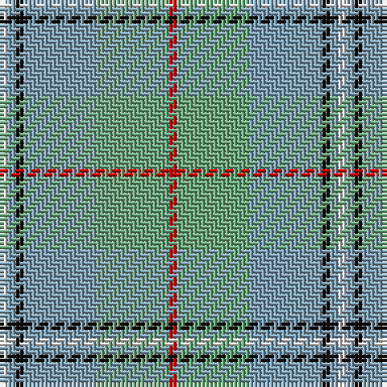

The parent of this is [Irving of Glentulchan (Personal)](/tartans/ln/2/b2/k2/b18/lg18/r/2/)

This was sourced from tartans-authority.  It is a [6 stripes tartan](/stripes/stripes6/).

Original link http://www.tartansauthority.com/tartan-ferret/display/1460/

## Thread count
LN/2 B2 K2 B18 LG18 R/2

## Palette
Each colour and its ΔE from the base-6 reference it is a variant of.

| Colour | Shade | Base | ΔE (OKLab) |
|---|---|---|---|
| B |  `#80A0B4` | Y  | 0.24 |
| K |  `#101010` | K  | 0.17 |
| LG |  `#70A880` | Y  | 0.20 |
| LN |  `#E0E0E0` | W  | 0.06 |
| R |  `#C80000` | R  | 0.00 |

# Sample pattern

ID: /variants/ln/2/b2/k2/b18/lg18/r/2-b80a0b4-k101010-lg70a880-lne0e0e0-rc80000/
