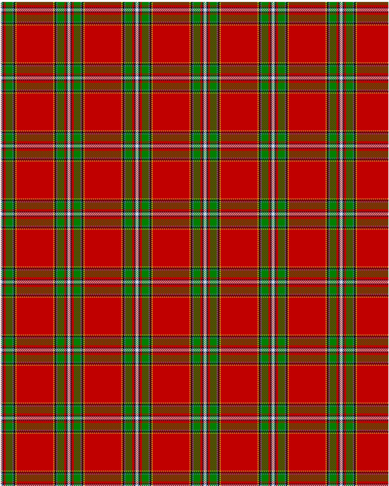

The parent of this is [Drummond, Ancient](/tartans/ln/2/b2/k2/r4/g14/b2/k4/y2/r/38/)

This was sourced from <no value>.  It is a [9 stripes tartan](/stripes/stripes9/).

Original link http://www.weddslist.com/cgi-bin/tartans/pg.pl?source=sts

## Thread count
LN/2 B2 K2 R4 G14 B2 K4 Y2 R/38

## Palette
B G K LN R Y

# Sample pattern

ID: /variants/ln/2/b2/k2/r4/g14/b2/k4/y2/r/38-b5480b0-g008000-k000000-lne0e0e0-rc00000-yf0c000/