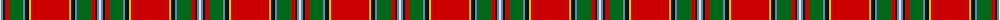

The parent of this is [Drummond Old Clan Tartan Tartan Number: 1716. Earliest known date: c.1930 MacGregor-Hasties collection formed the basis of the Scottish Tartans Society collection. Unfortunately many samples were neither dated or sourced. See products available Copyright © Blair Urquhart, Comrie, 2015](/tartans/ln/2/b2/k2/r4/g14/b2/k4/y2/r/38/)

This was sourced from house-of-tartan.  It is a [9 stripes tartan](/stripes/stripes9/).

Original link http://www.house-of-tartan.scotland.net/house/TartanViewjs.asp?colr=Def&tnam=1716

## Thread count
LN/2 B2 K2 R4 G14 B2 K4 Y2 R/38

## Palette
Each colour and its ΔE from the base-6 reference it is a variant of.

| Colour | Shade | Base | ΔE (OKLab) |
|---|---|---|---|
| B |  `#5C8CA8` | B  | 0.23 |
| G |  `#006818` | G  | 0.02 |
| K |  `#101010` | K  | 0.17 |
| LN |  `#E0E0E0` | W  | 0.06 |
| R |  `#C80000` | R  | 0.00 |
| Y |  `#E8C000` | Y  | 0.00 |

ID: /variants/ln/2/b2/k2/r4/g14/b2/k4/y2/r/38-b5c8ca8-g006818-k101010-lne0e0e0-rc80000-ye8c000/
