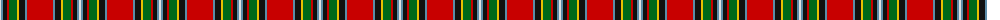

The parent of this is [Gillespie Family Tartan Tartan Number: 1361. Earliest known date: pre 1992 Scott Adie were retailers from c.1860 See products available Copyright © Blair Urquhart, Comrie, 2015](/tartans/ln/2/b2/k4/r2/g8/y2/k6/b2/r/26/)

This was sourced from house-of-tartan.  It is a [9 stripes tartan](/stripes/stripes9/).

Original link http://www.house-of-tartan.scotland.net/house/TartanViewjs.asp?colr=Def&tnam=1361

## Thread count
LN/2 B2 K4 R2 G8 Y2 K6 B2 R/26

## Palette
Each colour and its ΔE from the base-6 reference it is a variant of.

| Colour | Shade | Base | ΔE (OKLab) |
|---|---|---|---|
| B |  `#5C8CA8` | B  | 0.23 |
| G |  `#006818` | G  | 0.02 |
| K |  `#101010` | K  | 0.17 |
| LN |  `#E0E0E0` | W  | 0.06 |
| R |  `#C80000` | R  | 0.00 |
| Y |  `#E8C000` | Y  | 0.00 |

ID: /variants/ln/2/b2/k4/r2/g8/y2/k6/b2/r/26-b5c8ca8-g006818-k101010-lne0e0e0-rc80000-ye8c000/
