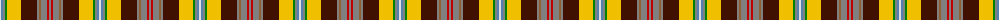

The parent of this is [Porcupine](/tartans/ln/2/b2/n2/g2/y14/dr16/n2/lt2/n6/r2/n/2/)

This was sourced from weddslist.  It is a [11 stripes tartan](/stripes/stripes11/).

Original link http://www.weddslist.com/cgi-bin/tartans/pg.pl?source=sts

## Thread count
LN/2 B2 N2 G2 Y14 DR16 N2 LT2 N6 R2 N/2

## Palette
Each colour and its ΔE from the base-6 reference it is a variant of.

| Colour | Shade | Base | ΔE (OKLab) |
|---|---|---|---|
| B |  `#5480B0` | B  | 0.20 |
| DR |  `#401000` | B  | 0.23 |
| G |  `#008000` | G  | 0.09 |
| LN |  `#E0E0E0` | W  | 0.06 |
| LT |  `#906030` | R  | 0.15 |
| N |  `#808080` | G  | 0.22 |
| R |  `#C00000` | R  | 0.02 |
| Y |  `#F0C000` | Y  | 0.01 |

ID: /variants/ln/2/b2/n2/g2/y14/dr16/n2/lt2/n6/r2/n/2-b5480b0-dr401000-g008000-lne0e0e0-lt906030-n808080-rc00000-yf0c000/
