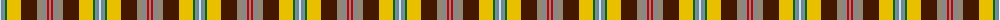

The parent of this is [Porcupine Fancy Tartan Tartan Number: 1303. Earliest known date: 1969 Some mention of MacDougall and a Wilson connection. See products available Copyright © Blair Urquhart, Comrie, 2015](/tartans/ln/2/b2/n2/g2/y14/dr16/n2/lt2/n6/r2/n/2/)

This was sourced from house-of-tartan.  It is a [11 stripes tartan](/stripes/stripes11/).

Original link http://www.house-of-tartan.scotland.net/house/TartanViewjs.asp?colr=Def&tnam=1303

## Thread count
LN/2 B2 N2 G2 Y14 DR16 N2 LT2 N6 R2 N/2

## Palette
Each colour and its ΔE from the base-6 reference it is a variant of.

| Colour | Shade | Base | ΔE (OKLab) |
|---|---|---|---|
| B |  `#5C8CA8` | B  | 0.23 |
| DR |  `#441800` | B  | 0.22 |
| G |  `#006818` | G  | 0.02 |
| LN |  `#E0E0E0` | W  | 0.06 |
| LT |  `#A08858` | Y  | 0.21 |
| N |  `#888888` | R  | 0.24 |
| R |  `#C80000` | R  | 0.00 |
| Y |  `#E8C000` | Y  | 0.00 |

ID: /variants/ln/2/b2/n2/g2/y14/dr16/n2/lt2/n6/r2/n/2-b5c8ca8-dr441800-g006818-lne0e0e0-lta08858-n888888-rc80000-ye8c000/
