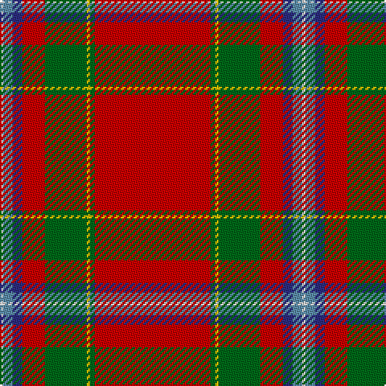

The parent of this is [Stewart of Fingask Clan Tartan Tartan Number: 1553. Earliest known date: 1745 This tartan is almost identical to the Drummond of Perth. It was one of the valueable relics of the '45, treasured by the Murray-Threipland family of Fingask. It was said to be the pattern of a cloak of Prince Charles Edward, who left it at Fingask after staying there at the time of the '45. See products available Copyright © Blair Urquhart, Comrie, 2015](/tartans/ln/2/b6/db6/r14/g26/y2/g3/r/72/)

This was sourced from house-of-tartan.  It is a [8 stripes tartan](/stripes/stripes8/).

Original link http://www.house-of-tartan.scotland.net/house/TartanViewjs.asp?colr=Def&tnam=1553

## Thread count
LN/2 B6 DB6 R14 G26 Y2 G3 R/72

## Palette
Each colour and its ΔE from the base-6 reference it is a variant of.

| Colour | Shade | Base | ΔE (OKLab) |
|---|---|---|---|
| B |  `#5C8CA8` | B  | 0.23 |
| DB |  `#2C2C80` | B  | 0.05 |
| G |  `#006818` | G  | 0.02 |
| LN |  `#E0E0E0` | W  | 0.06 |
| R |  `#C80000` | R  | 0.00 |
| Y |  `#E8C000` | Y  | 0.00 |

# Sample pattern

ID: /variants/ln/2/b6/db6/r14/g26/y2/g3/r/72-b5c8ca8-db2c2c80-g006818-lne0e0e0-rc80000-ye8c000/
