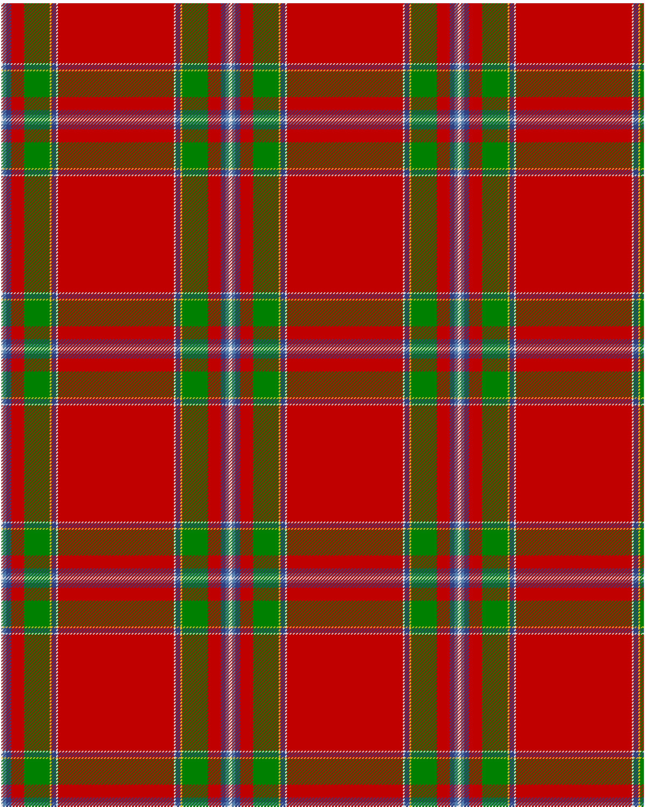

The parent of this is [Drummond of Perth](/tartans/ln/2/ba4/b6/r16/g32/y2/b6/ln2/r/72/)

This was sourced from <no value>.  It is a [9 stripes tartan](/stripes/stripes9/).

Original link http://www.weddslist.com/cgi-bin/tartans/pg.pl?source=sts

## Thread count
LN/2 BA4 B6 R16 G32 Y2 B6 LN2 R/72

## Palette
B BA G LN R Y

# Sample pattern

ID: /variants/ln/2/ba4/b6/r16/g32/y2/b6/ln2/r/72-b304080-ba5480b0-g008000-lne0e0e0-rc00000-yf0c000/