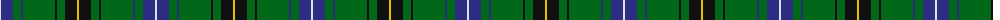

The parent of this is [Henderson MacKendrick Clan Tartan Tartan Number: 1762. Earliest known date: 1906 The name Henderson in Gaelic is MacEanruig, which is sometimes rendered as MacKendrick. Hendersons from the north are associated with the Gunns. Hendersons lived in Lochaber and Angus. The Henderson tartan resembles the Davidson, both of which were first recorded by W & A.K.Johnston in 1906. See products available Copyright © Blair Urquhart, Comrie, 2015](/tartans/ln/2/db12/g8/db2/g32/k2/g8/k12/y/2/)

This was sourced from house-of-tartan.  It is a [9 stripes tartan](/stripes/stripes9/).

Original link http://www.house-of-tartan.scotland.net/house/TartanViewjs.asp?colr=Def&tnam=1762

## Thread count
LN/2 DB12 G8 DB2 G32 K2 G8 K12 Y/2

## Palette
Each colour and its ΔE from the base-6 reference it is a variant of.

| Colour | Shade | Base | ΔE (OKLab) |
|---|---|---|---|
| DB |  `#2C2C80` | B  | 0.05 |
| G |  `#006818` | G  | 0.02 |
| K |  `#101010` | K  | 0.17 |
| LN |  `#E0E0E0` | W  | 0.06 |
| Y |  `#E8C000` | Y  | 0.00 |

ID: /variants/ln/2/db12/g8/db2/g32/k2/g8/k12/y/2-db2c2c80-g006818-k101010-lne0e0e0-ye8c000/
