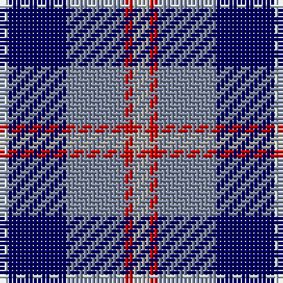

The parent of this is [Bryson (1988) (Name)](/tartans/ln/2/db14/b14/r2/n/4/)

This was sourced from tartans-authority.  It is a [5 stripes tartan](/stripes/stripes5/).

Original link http://www.tartansauthority.com/tartan-ferret/display/3746/

## Thread count
LN/2 DB14 B14 R2 N/4

## Palette
Each colour and its ΔE from the base-6 reference it is a variant of.

| Colour | Shade | Base | ΔE (OKLab) |
|---|---|---|---|
| B |  `#78849C` | B  | 0.23 |
| DB |  `#000064` | B  | 0.17 |
| LN |  `#C8D8DC` | W  | 0.10 |
| N |  `#A0A0A0` | Y  | 0.20 |
| R |  `#C80000` | R  | 0.00 |

# Sample pattern

ID: /variants/ln/2/db14/b14/r2/n/4-b78849c-db000064-lnc8d8dc-na0a0a0-rc80000/
