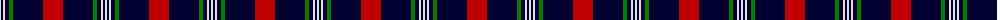
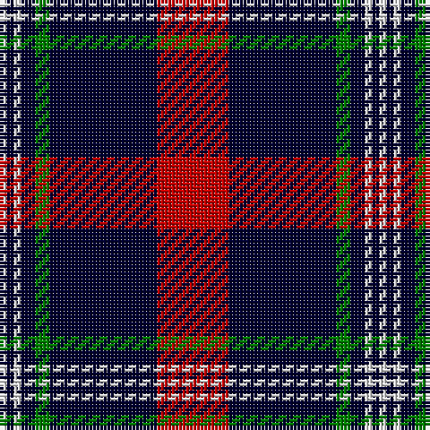

The parent of this is [Ikelman No 4](/tartans/ln/2/db2/ln2/db4/g4/db30/r/20/)

This was sourced from weddslist.  It is a [7 stripes tartan](/stripes/stripes7/).

Original link http://www.weddslist.com/cgi-bin/tartans/pg.pl?source=sts

## Thread count
LN/2 DB2 LN2 DB4 G4 DB30 R/20

## Palette
Each colour and its ΔE from the base-6 reference it is a variant of.

| Colour | Shade | Base | ΔE (OKLab) |
|---|---|---|---|
| DB |  `#000030` | K  | 0.17 |
| G |  `#008000` | G  | 0.09 |
| LN |  `#E0E0E0` | W  | 0.06 |
| R |  `#C00000` | R  | 0.02 |

# Sample pattern

ID: /variants/ln/2/db2/ln2/db4/g4/db30/r/20-db000030-g008000-lne0e0e0-rc00000/
