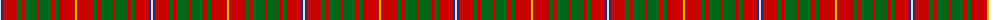

The parent of this is [Bruce County District Tartan Tartan Number: 1778. Earliest known date: 1964 Bruce County is an administrative district of the Province of Ontario. The design is attributed to Lord Bruce, the son of the Earl of Elgin, and chief of the Clan Bruce, for his role in adapting the Bruce clan tartan. Two blue stripes have been added to represent the coastline of Lake Huron and Georgian Bay. See products available Copyright © Blair Urquhart, Comrie, 2015](/tartans/ln/2/db2/r14/g4/r4/g12/r2/g12/r4/g4/r16/y/2/)

This was sourced from house-of-tartan.  It is a [12 stripes tartan](/stripes/stripes12/).

Original link http://www.house-of-tartan.scotland.net/house/TartanViewjs.asp?colr=Def&tnam=1778

## Thread count
LN/2 DB2 R14 G4 R4 G12 R2 G12 R4 G4 R16 Y/2

## Palette
Each colour and its ΔE from the base-6 reference it is a variant of.

| Colour | Shade | Base | ΔE (OKLab) |
|---|---|---|---|
| DB |  `#2C2C80` | B  | 0.05 |
| G |  `#006818` | G  | 0.02 |
| LN |  `#E0E0E0` | W  | 0.06 |
| R |  `#C80000` | R  | 0.00 |
| Y |  `#E8C000` | Y  | 0.00 |

ID: /variants/ln/2/db2/r14/g4/r4/g12/r2/g12/r4/g4/r16/y/2-db2c2c80-g006818-lne0e0e0-rc80000-ye8c000/
