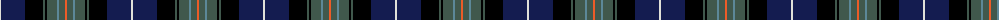

The parent of this is [St Andrews Golf Club Corporate Tartan Tartan Number: 10643. Earliest known date: 18/10/2011 The pattern for this tartan was created by the Secretary and Chairman with the assistance of the designers at House of Tartan. The colours are taken from the club's crest. See products available Copyright © Blair Urquhart, Comrie, 2015](/tartans/ln/2/db24/k18/n2/k2/n10/b2/n6/o/2/)

This was sourced from house-of-tartan.  It is a [9 stripes tartan](/stripes/stripes9/).

Original link http://www.house-of-tartan.scotland.net/house/TartanViewjs.asp?colr=Def&tnam=10643

## Thread count
LN/2 DB24 K18 N2 K2 N10 B2 N6 O/2

## Palette
Each colour and its ΔE from the base-6 reference it is a variant of.

| Colour | Shade | Base | ΔE (OKLab) |
|---|---|---|---|
| B |  `#5C8898` | G  | 0.22 |
| DB |  `#141C50` | B  | 0.14 |
| K |  `#000000` | K  | 0.00 |
| LN |  `#E0E0D8` | W  | 0.06 |
| N |  `#40584C` | G  | 0.12 |
| O |  `#EC5C28` | R  | 0.14 |

ID: /variants/ln/2/db24/k18/n2/k2/n10/b2/n6/o/2-b5c8898-db141c50-k000000-lne0e0d8-n40584c-oec5c28/
