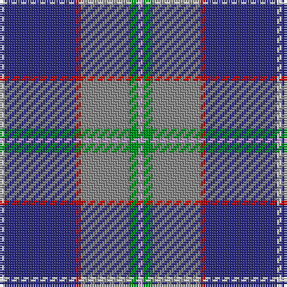

The parent of this is [Peterson, Oren (Name)](/tartans/ln/2/db30/r2/n20/g4/lp/2/)

This was sourced from tartans-authority.  It is a [6 stripes tartan](/stripes/stripes6/).

Original link http://www.tartansauthority.com/tartan-ferret/display/10127/

## Thread count
LN/2 DB30 R2 N20 G4 LP/2

## Palette
Each colour and its ΔE from the base-6 reference it is a variant of.

| Colour | Shade | Base | ΔE (OKLab) |
|---|---|---|---|
| DB |  `#2C2C80` | B  | 0.05 |
| G |  `#009020` | G  | 0.14 |
| LN |  `#E0E0E0` | W  | 0.06 |
| LP |  `#C49CD8` | W  | 0.24 |
| N |  `#888888` | R  | 0.24 |
| R |  `#C80000` | R  | 0.00 |

# Sample pattern

ID: /variants/ln/2/db30/r2/n20/g4/lp/2-db2c2c80-g009020-lne0e0e0-lpc49cd8-n888888-rc80000/
