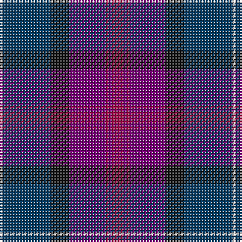

The parent of this is [First (Corporate)](/tartans/ln/2/db32/k12/p24/r2/p2/r/8/)

This was sourced from tartans-authority.  It is a [7 stripes tartan](/stripes/stripes7/).

Original link http://www.tartansauthority.com/tartan-ferret/display/6904/

## Thread count
LN/2 DB32 K12 P24 R2 P2 R/8

## Palette
Each colour and its ΔE from the base-6 reference it is a variant of.

| Colour | Shade | Base | ΔE (OKLab) |
|---|---|---|---|
| DB |  `#003C64` | B  | 0.07 |
| K |  `#101010` | K  | 0.17 |
| LN |  `#E0E0E0` | W  | 0.06 |
| P |  `#780078` | B  | 0.16 |
| R |  `#A00048` | R  | 0.11 |

# Sample pattern

ID: /variants/ln/2/db32/k12/p24/r2/p2/r/8-db003c64-k101010-lne0e0e0-p780078-ra00048/
