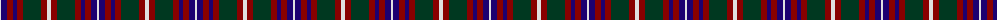
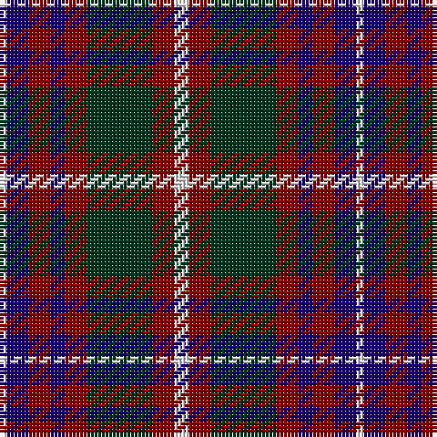

The parent of this is [Utah State American District Tartan Tartan Number: 2702. Earliest known date: 1995 Utah state tartan was commissioned by Garry Bryant, KdeB, KCR, SC, designed by Dr. Phil Smith and adopted by a joint committee of the state's Scottish Societies and made official by Senate Resolution. A combination of the Logan and Skene tartans to honour the first two fur trappers to enter Utah. Sample in STA Johnston Collection. Tartan Society notes add: It is the Logan Tartan TS399 with a white over check added and a blue substituted for a white. Ephraim Logan was an early visitor to Cache Valley in northern Utah in 1824 naming the river after his clan/family name. Official threadcount tripled. See products available Copyright © Blair Urquhart, Comrie, 2015](/tartans/ln/2/db6/dr6/db4/dr6/dg18/dr6/ln/4/)

This was sourced from house-of-tartan.  It is a [8 stripes tartan](/stripes/stripes8/).

Original link http://www.house-of-tartan.scotland.net/house/TartanViewjs.asp?colr=Def&tnam=2702

## Thread count
LN/2 DB6 DR6 DB4 DR6 DG18 DR6 LN/4

## Palette
Each colour and its ΔE from the base-6 reference it is a variant of.

| Colour | Shade | Base | ΔE (OKLab) |
|---|---|---|---|
| DB |  `#1C0070` | B  | 0.14 |
| DG |  `#003820` | G  | 0.16 |
| DR |  `#880000` | R  | 0.14 |
| G |  `#006818` | G  | 0.02 |
| Ga |  `#285800` | G  | 0.04 |
| LN |  `#E0E0E0` | W  | 0.06 |
| N |  `#C0C0C0` | W  | 0.16 |

# Sample pattern

ID: /variants/ln/2/db6/dr6/db4/dr6/dg18/dr6/ln/4-db1c0070-dg003820-dr880000-g006818-ga285800-lne0e0e0-nc0c0c0/
