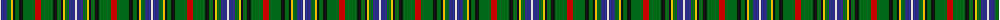

The parent of this is [Bisset Clan Tartan Tartan Number: 1478. Earliest known date: 1976 One of the first tartans designed by the Scottish Tartans Society for a Mrs E. Bisset, who gave the following details for the colours of the sett: The blue and white of the Bisset shield, yellow and black representing the motto, red for the 'eternal flame' and the local tartan; all on a green background. The motto of the Bissets is 'Abscissa virescit' meaning 'Cut me down and I shall grow again'. The yellow represents the wood chips from the axe and the green for the fresh new growth. Bissets are represented in the histories of prominent Scottish families through the female line. Both Chisholms and Frasers married heiress's of the Bisset family. The result being that the Bisset surname has greatly reduced in number. There is no chief of the family at present (1993) but the senior branch are the Bissets of Lessendrum in Aberdeenshire. See products available Copyright © Blair Urquhart, Comrie, 2015](/tartans/ln/2/db6/g4/y2/k2/g4/k4/g12/r/6/)

This was sourced from house-of-tartan.  It is a [9 stripes tartan](/stripes/stripes9/).

Original link http://www.house-of-tartan.scotland.net/house/TartanViewjs.asp?colr=Def&tnam=1478

## Thread count
LN/2 DB6 G4 Y2 K2 G4 K4 G12 R/6

## Palette
Each colour and its ΔE from the base-6 reference it is a variant of.

| Colour | Shade | Base | ΔE (OKLab) |
|---|---|---|---|
| DB |  `#2C2C80` | B  | 0.05 |
| G |  `#006818` | G  | 0.02 |
| K |  `#101010` | K  | 0.17 |
| LN |  `#E0E0E0` | W  | 0.06 |
| R |  `#C80000` | R  | 0.00 |
| Y |  `#E8C000` | Y  | 0.00 |

ID: /variants/ln/2/db6/g4/y2/k2/g4/k4/g12/r/6-db2c2c80-g006818-k101010-lne0e0e0-rc80000-ye8c000/
