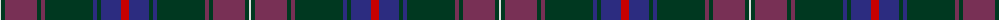

The parent of this is [Kinfauns Castle](/tartans/ln/2/dg4/dr32/dg4/dr4/dg48/db4/dg4/db20/r/8/)

This was sourced from register-of-tartans.  It is a [10 stripes tartan](/stripes/stripes10/).

Original link https://www.tartanregister.gov.uk/tartanDetails.aspx?ref=1979

## Thread count
LN/2 DG4 DR32 DG4 DR4 DG48 DB4 DG4 DB20 R/8

## Palette
Each colour and its ΔE from the base-6 reference it is a variant of.

| Colour | Shade | Base | ΔE (OKLab) |
|---|---|---|---|
| DB |  `#2C2C80` | B  | 0.05 |
| DG |  `#003820` | G  | 0.16 |
| DR |  `#783055` | B  | 0.15 |
| LN |  `#E0E0E0` | W  | 0.06 |
| R |  `#C80000` | R  | 0.00 |

ID: /variants/ln/2/dg4/dr32/dg4/dr4/dg48/db4/dg4/db20/r/8-db2c2c80-dg003820-dr783055-lne0e0e0-rc80000/
