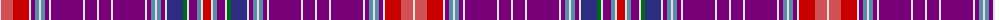

The parent of this is [Brides Plaid Artifact Tartan Tartan Number: 1680. Earliest known date: 1730 Previously listed as unidentified. See products available Copyright © Blair Urquhart, Comrie, 2015](/tartans/ln/2/do12/r16/ln2/p4/b4/ln2/b4/p4/ln2/p32/ln2/p12/ln2/p12/ln2/p32/ln2/p4/b4/ln2/b4/p4/ln2/db16/g4/ln2/p8/b4/ln2/r/8/)

This was sourced from house-of-tartan.  It is a [31 stripes tartan](/stripes/stripes31/).

Original link http://www.house-of-tartan.scotland.net/house/TartanViewjs.asp?colr=Def&tnam=1680

## Thread count
LN/2 DO12 R16 LN2 P4 B4 LN2 B4 P4 LN2 P32 LN2 P12 LN2 P12 LN2 P32 LN2 P4 B4 LN2 B4 P4 LN2 DB16 G4 LN2 P8 B4 LN2 R/8

## Palette
Each colour and its ΔE from the base-6 reference it is a variant of.

| Colour | Shade | Base | ΔE (OKLab) |
|---|---|---|---|
| B |  `#5C8CA8` | B  | 0.23 |
| DB |  `#2C2C80` | B  | 0.05 |
| DO |  `#D05054` | R  | 0.10 |
| G |  `#006818` | G  | 0.02 |
| LN |  `#E0E0E0` | W  | 0.06 |
| P |  `#780078` | B  | 0.16 |
| R |  `#C80000` | R  | 0.00 |

ID: /variants/ln/2/do12/r16/ln2/p4/b4/ln2/b4/p4/ln2/p32/ln2/p12/ln2/p12/ln2/p32/ln2/p4/b4/ln2/b4/p4/ln2/db16/g4/ln2/p8/b4/ln2/r/8-b5c8ca8-db2c2c80-dod05054-g006818-lne0e0e0-p780078-rc80000/
