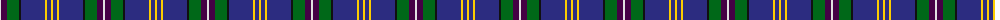
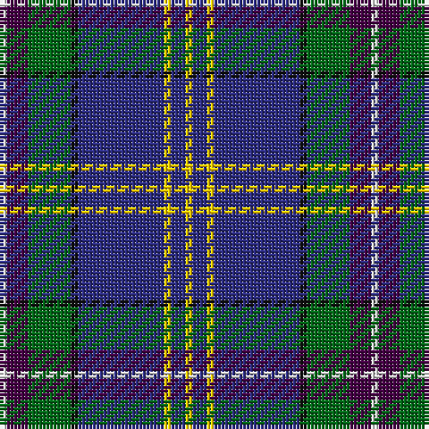

The parent of this is [Lambert, Patrice (Personal)](/tartans/ln/2/dp6/g12/k2/db24/y2/db4/y/2/)

This was sourced from tartans-authority.  It is a [8 stripes tartan](/stripes/stripes8/).

Original link http://www.tartansauthority.com/tartan-ferret/display/10433/

## Thread count
LN/2 DP6 G12 K2 DB24 Y2 DB4 Y/2

## Palette
Each colour and its ΔE from the base-6 reference it is a variant of.

| Colour | Shade | Base | ΔE (OKLab) |
|---|---|---|---|
| DB |  `#2C2C80` | B  | 0.05 |
| DP |  `#440044` | B  | 0.17 |
| G |  `#006818` | G  | 0.02 |
| K |  `#101010` | K  | 0.17 |
| LN |  `#E0E0E0` | W  | 0.06 |
| Y |  `#FCCC00` | Y  | 0.04 |

# Sample pattern

ID: /variants/ln/2/dp6/g12/k2/db24/y2/db4/y/2-db2c2c80-dp440044-g006818-k101010-lne0e0e0-yfccc00/
