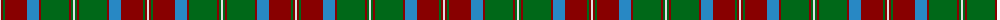

The parent of this is [Glen Tilt #2](/tartans/ln/2/dr2/g2/dr22/b12/dr2/g28/dr2/g2/ln/2/)

This was sourced from register-of-tartans.  It is a [10 stripes tartan](/stripes/stripes10/).

Original link https://www.tartanregister.gov.uk/tartanDetails.aspx?ref=1400

## Thread count
LN/2 DR2 G2 DR22 B12 DR2 G28 DR2 G2 LN/2

## Palette
Each colour and its ΔE from the base-6 reference it is a variant of.

| Colour | Shade | Base | ΔE (OKLab) |
|---|---|---|---|
| B |  `#2888C4` | B  | 0.21 |
| DR |  `#880000` | R  | 0.14 |
| G |  `#006818` | G  | 0.02 |
| LN |  `#E0E0E0` | W  | 0.06 |

ID: /variants/ln/2/dr2/g2/dr22/b12/dr2/g28/dr2/g2/ln/2-b2888c4-dr880000-g006818-lne0e0e0/
