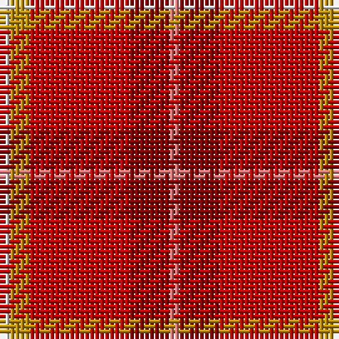

The parent of this is [Love (Fashion)](/tartans/ln/2/dy4/r20/dr8/lr/2/)

This was sourced from tartans-authority.  It is a [5 stripes tartan](/stripes/stripes5/).

Original link http://www.tartansauthority.com/tartan-ferret/display/10521/

## Thread count
LN/2 DY4 R20 DR8 LR/2

## Palette
Each colour and its ΔE from the base-6 reference it is a variant of.

| Colour | Shade | Base | ΔE (OKLab) |
|---|---|---|---|
| DR |  `#880000` | R  | 0.14 |
| DY |  `#BC8C00` | Y  | 0.16 |
| LN |  `#E0E0E0` | W  | 0.06 |
| LR |  `#E87878` | R  | 0.19 |
| R |  `#C80000` | R  | 0.00 |

# Sample pattern

ID: /variants/ln/2/dy4/r20/dr8/lr/2-dr880000-dybc8c00-lne0e0e0-lre87878-rc80000/
