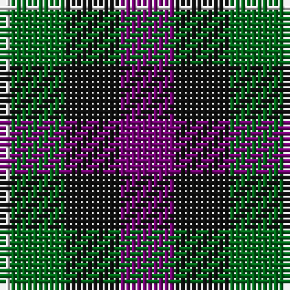

The parent of this is [Wilson's No.220](/tartans/ln/2/g10/k10/p/10/)

This was sourced from register-of-tartans.  It is a [4 stripes tartan](/stripes/stripes4/).

Original link https://www.tartanregister.gov.uk/tartanDetails.aspx?ref=4748

## Thread count
LN/2 G10 K10 P/10

## Palette
Each colour and its ΔE from the base-6 reference it is a variant of.

| Colour | Shade | Base | ΔE (OKLab) |
|---|---|---|---|
| DG |  `#003820` | G  | 0.16 |
| DP |  `#500050` | B  | 0.16 |
| G |  `#006818` | G  | 0.02 |
| K |  `#101010` | K  | 0.17 |
| LN |  `#E0E0E0` | W  | 0.06 |
| P |  `#740074` | B  | 0.16 |

# Sample pattern

ID: /variants/ln/2/g10/k10/p/10-dg003820-dp500050-g006818-k101010-lne0e0e0-p740074/
