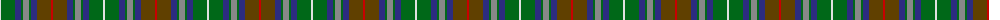

The parent of this is [Adamson (Personal)](/tartans/ln/2/g14/db6/g2/n6/g2/db6/t14/r/2/)

This was sourced from tartans-authority.  It is a [9 stripes tartan](/stripes/stripes9/).

Original link http://www.tartansauthority.com/tartan-ferret/display/7942/

## Thread count
LN/2 G14 DB6 G2 N6 G2 DB6 T14 R/2

## Palette
Each colour and its ΔE from the base-6 reference it is a variant of.

| Colour | Shade | Base | ΔE (OKLab) |
|---|---|---|---|
| DB |  `#2C2C80` | B  | 0.05 |
| G |  `#006818` | G  | 0.02 |
| LN |  `#E0E0E0` | W  | 0.06 |
| N |  `#888888` | R  | 0.24 |
| R |  `#C80000` | R  | 0.00 |
| T |  `#604000` | G  | 0.14 |

ID: /variants/ln/2/g14/db6/g2/n6/g2/db6/t14/r/2-db2c2c80-g006818-lne0e0e0-n888888-rc80000-t604000/
