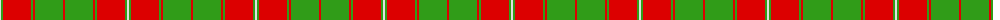
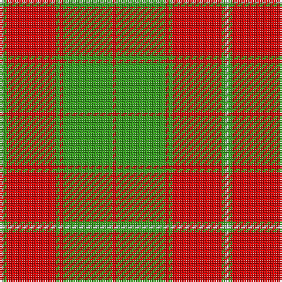

The parent of this is [MacKintosh Fragment](/tartans/ln/2/g2/r28/g2/r2/g28/r/2/)

This was sourced from register-of-tartans.  It is a [7 stripes tartan](/stripes/stripes7/).

Original link https://www.tartanregister.gov.uk/tartanDetails.aspx?ref=2572

## Thread count
LN/2 G2 R28 G2 R2 G28 R/2

## Palette
Each colour and its ΔE from the base-6 reference it is a variant of.

| Colour | Shade | Base | ΔE (OKLab) |
|---|---|---|---|
| G |  `#309C18` | G  | 0.18 |
| LN |  `#E0E0E0` | W  | 0.06 |
| R |  `#DC0000` | R  | 0.04 |

# Sample pattern

ID: /variants/ln/2/g2/r28/g2/r2/g28/r/2-g309c18-lne0e0e0-rdc0000/
