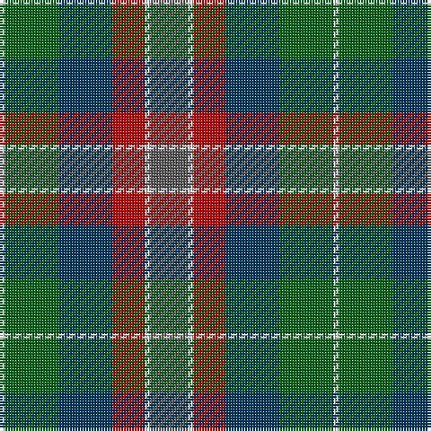

The parent of this is [McEachem (Name)](/tartans/ln/2/g20/db20/r12/ln2/n/14/)

This was sourced from tartans-authority.  It is a [6 stripes tartan](/stripes/stripes6/).

Original link http://www.tartansauthority.com/tartan-ferret/display/10765/

## Thread count
LN/2 G20 DB20 R12 LN2 N/14

## Palette
Each colour and its ΔE from the base-6 reference it is a variant of.

| Colour | Shade | Base | ΔE (OKLab) |
|---|---|---|---|
| DB |  `#003C64` | B  | 0.07 |
| G |  `#006818` | G  | 0.02 |
| LN |  `#E0E0E0` | W  | 0.06 |
| N |  `#5C5C5C` | B  | 0.14 |
| R |  `#C80000` | R  | 0.00 |

# Sample pattern

ID: /variants/ln/2/g20/db20/r12/ln2/n/14-db003c64-g006818-lne0e0e0-n5c5c5c-rc80000/
