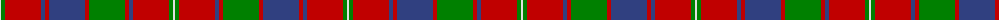

The parent of this is [Robertson 7](/tartans/ln/2/g4/r36/b4/r4/b36/r4/g36/r4/b4/r36/g4/ln/2/)

This was sourced from weddslist.  It is a [13 stripes tartan](/stripes/stripes13/).

Original link http://www.weddslist.com/cgi-bin/tartans/pg.pl?source=sts

## Thread count
LN/2 G4 R36 B4 R4 B36 R4 G36 R4 B4 R36 G4 LN/2

## Palette
Each colour and its ΔE from the base-6 reference it is a variant of.

| Colour | Shade | Base | ΔE (OKLab) |
|---|---|---|---|
| B |  `#304080` | B  | 0.01 |
| G |  `#008000` | G  | 0.09 |
| LN |  `#E0E0E0` | W  | 0.06 |
| R |  `#C00000` | R  | 0.02 |

ID: /variants/ln/2/g4/r36/b4/r4/b36/r4/g36/r4/b4/r36/g4/ln/2-b304080-g008000-lne0e0e0-rc00000/
