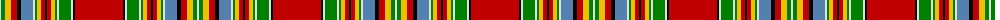

The parent of this is [MacKintosh 7](/tartans/ln/2/g4/y6/r6/k4/b12/ln2/g2/y4/r4/k2/r4/y4/g2/ln2/g12/ln2/k2/r/48/)

This was sourced from weddslist.  It is a [19 stripes tartan](/stripes/stripes19/).

Original link http://www.weddslist.com/cgi-bin/tartans/pg.pl?source=sts

## Thread count
LN/2 G4 Y6 R6 K4 B12 LN2 G2 Y4 R4 K2 R4 Y4 G2 LN2 G12 LN2 K2 R/48

## Palette
Each colour and its ΔE from the base-6 reference it is a variant of.

| Colour | Shade | Base | ΔE (OKLab) |
|---|---|---|---|
| B |  `#5480B0` | B  | 0.20 |
| G |  `#008000` | G  | 0.09 |
| K |  `#000000` | K  | 0.00 |
| LN |  `#E0E0E0` | W  | 0.06 |
| R |  `#C00000` | R  | 0.02 |
| Y |  `#F0C000` | Y  | 0.01 |

ID: /variants/ln/2/g4/y6/r6/k4/b12/ln2/g2/y4/r4/k2/r4/y4/g2/ln2/g12/ln2/k2/r/48-b5480b0-g008000-k000000-lne0e0e0-rc00000-yf0c000/
