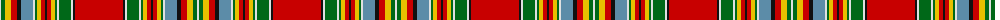

The parent of this is [MacKintosh (Chief) Clan Tartan Tartan Number: 1616. Earliest known date: 1810-15 Logan wrote 'The Chief also wears a particular tartan of a very showy pattern' and the Smiths of Mauchline illustrated it in their 1850 book 'Authenticated Tartans of the Clans & Families of Scotland' See products available Copyright © Blair Urquhart, Comrie, 2015](/tartans/ln/2/g4/y6/r6/k4/b12/ln2/g2/y4/r4/k2/r4/y4/g2/ln2/g12/ln2/k2/r/48/)

This was sourced from house-of-tartan.  It is a [19 stripes tartan](/stripes/stripes19/).

Original link http://www.house-of-tartan.scotland.net/house/TartanViewjs.asp?colr=Def&tnam=1616

## Thread count
LN/2 G4 Y6 R6 K4 B12 LN2 G2 Y4 R4 K2 R4 Y4 G2 LN2 G12 LN2 K2 R/48

## Palette
Each colour and its ΔE from the base-6 reference it is a variant of.

| Colour | Shade | Base | ΔE (OKLab) |
|---|---|---|---|
| B |  `#5C8CA8` | B  | 0.23 |
| G |  `#006818` | G  | 0.02 |
| K |  `#101010` | K  | 0.17 |
| LN |  `#E0E0E0` | W  | 0.06 |
| R |  `#C80000` | R  | 0.00 |
| Y |  `#E8C000` | Y  | 0.00 |

ID: /variants/ln/2/g4/y6/r6/k4/b12/ln2/g2/y4/r4/k2/r4/y4/g2/ln2/g12/ln2/k2/r/48-b5c8ca8-g006818-k101010-lne0e0e0-rc80000-ye8c000/
