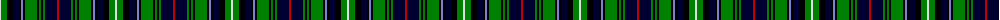

The parent of this is [Elgin - Landshut](/tartans/ln/2/g6/k6/db6/k2/b2/k2/g12/k2/g2/k2/g2/db12/r/2/)

This was sourced from weddslist.  It is a [14 stripes tartan](/stripes/stripes14/).

Original link http://www.weddslist.com/cgi-bin/tartans/pg.pl?source=sts

## Thread count
LN/2 G6 K6 DB6 K2 B2 K2 G12 K2 G2 K2 G2 DB12 R/2

## Palette
Each colour and its ΔE from the base-6 reference it is a variant of.

| Colour | Shade | Base | ΔE (OKLab) |
|---|---|---|---|
| B |  `#8080D0` | B  | 0.24 |
| DB |  `#000030` | K  | 0.17 |
| G |  `#008000` | G  | 0.09 |
| K |  `#000000` | K  | 0.00 |
| LN |  `#E0E0E0` | W  | 0.06 |
| R |  `#C00000` | R  | 0.02 |

ID: /variants/ln/2/g6/k6/db6/k2/b2/k2/g12/k2/g2/k2/g2/db12/r/2-b8080d0-db000030-g008000-k000000-lne0e0e0-rc00000/
