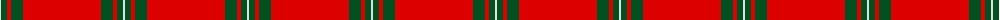

The parent of this is [MacGregor #2](/tartans/ln/2/g6/r4/g12/r/78/)

This was sourced from register-of-tartans.  It is a [5 stripes tartan](/stripes/stripes5/).

Original link https://www.tartanregister.gov.uk/tartanDetails.aspx?ref=2450

## Thread count
LN/2 G6 R4 G12 R/78

## Palette
Each colour and its ΔE from the base-6 reference it is a variant of.

| Colour | Shade | Base | ΔE (OKLab) |
|---|---|---|---|
| G |  `#005020` | G  | 0.08 |
| LN |  `#E0E0E0` | W  | 0.06 |
| R |  `#DC0000` | R  | 0.04 |

# Sample pattern

ID: /variants/ln/2/g6/r4/g12/r/78-g005020-lne0e0e0-rdc0000/
