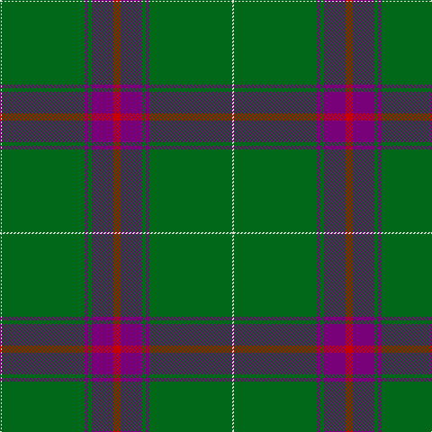

The parent of this is [Kinfauns Castle (Corporate)](/tartans/ln/2/g92/p4/g4/p24/r/8/)

This was sourced from tartans-authority.  It is a [6 stripes tartan](/stripes/stripes6/).

Original link http://www.tartansauthority.com/tartan-ferret/display/2535/

## Thread count
LN/2 G92 P4 G4 P24 R/8

## Palette
Each colour and its ΔE from the base-6 reference it is a variant of.

| Colour | Shade | Base | ΔE (OKLab) |
|---|---|---|---|
| G |  `#006818` | G  | 0.02 |
| LN |  `#E0E0E0` | W  | 0.06 |
| P |  `#780078` | B  | 0.16 |
| R |  `#C80000` | R  | 0.00 |

# Sample pattern

ID: /variants/ln/2/g92/p4/g4/p24/r/8-g006818-lne0e0e0-p780078-rc80000/
