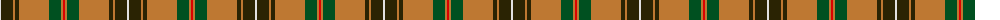
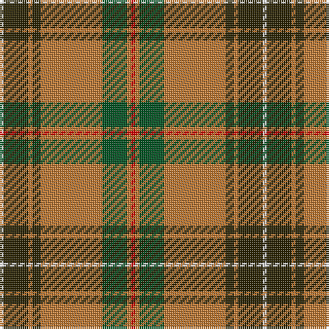

The parent of this is [Connacht #2](/tartans/ln/2/k12/do2/k4/do30/g12/do2/r/2/)

This was sourced from register-of-tartans.  It is a [8 stripes tartan](/stripes/stripes8/).

Original link https://www.tartanregister.gov.uk/tartanDetails.aspx?ref=5878

## Thread count
LN/2 K12 DO2 K4 DO30 G12 DO2 R/2

## Palette
Each colour and its ΔE from the base-6 reference it is a variant of.

| Colour | Shade | Base | ΔE (OKLab) |
|---|---|---|---|
| DO |  `#BE7832` | R  | 0.17 |
| G |  `#005020` | G  | 0.08 |
| K |  `#2A2303` | B  | 0.21 |
| LN |  `#E0E0E0` | W  | 0.06 |
| R |  `#DC0000` | R  | 0.04 |

# Sample pattern

ID: /variants/ln/2/k12/do2/k4/do30/g12/do2/r/2-dobe7832-g005020-k2a2303-lne0e0e0-rdc0000/
