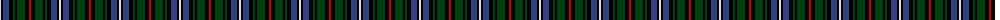

The parent of this is [MacKean dress](/tartans/ln/2/k2/b6/k4/dg2/k2/dg8/k4/r/2/)

This was sourced from weddslist.  It is a [9 stripes tartan](/stripes/stripes9/).

Original link http://www.weddslist.com/cgi-bin/tartans/pg.pl?source=sts

## Thread count
LN/2 K2 B6 K4 DG2 K2 DG8 K4 R/2

## Palette
Each colour and its ΔE from the base-6 reference it is a variant of.

| Colour | Shade | Base | ΔE (OKLab) |
|---|---|---|---|
| B |  `#304080` | B  | 0.01 |
| DG |  `#004010` | G  | 0.12 |
| K |  `#000000` | K  | 0.00 |
| LN |  `#E0E0E0` | W  | 0.06 |
| R |  `#C00000` | R  | 0.02 |

ID: /variants/ln/2/k2/b6/k4/dg2/k2/dg8/k4/r/2-b304080-dg004010-k000000-lne0e0e0-rc00000/
