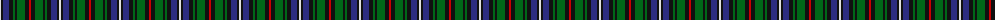

The parent of this is [MacKean Dress (Personal)](/tartans/ln/2/k2/db6/k4/g2/k2/g8/k4/r/2/)

This was sourced from register-of-tartans.  It is a [9 stripes tartan](/stripes/stripes9/).

Original link https://www.tartanregister.gov.uk/tartanDetails.aspx?ref=2509

## Thread count
LN/2 K2 DB6 K4 G2 K2 G8 K4 R/2

## Palette
Each colour and its ΔE from the base-6 reference it is a variant of.

| Colour | Shade | Base | ΔE (OKLab) |
|---|---|---|---|
| DB |  `#2C2C80` | B  | 0.05 |
| G |  `#006818` | G  | 0.02 |
| K |  `#101010` | K  | 0.17 |
| LN |  `#E0E0E0` | W  | 0.06 |
| R |  `#C80000` | R  | 0.00 |

ID: /variants/ln/2/k2/db6/k4/g2/k2/g8/k4/r/2-db2c2c80-g006818-k101010-lne0e0e0-rc80000/
