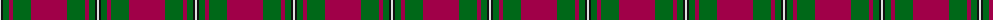
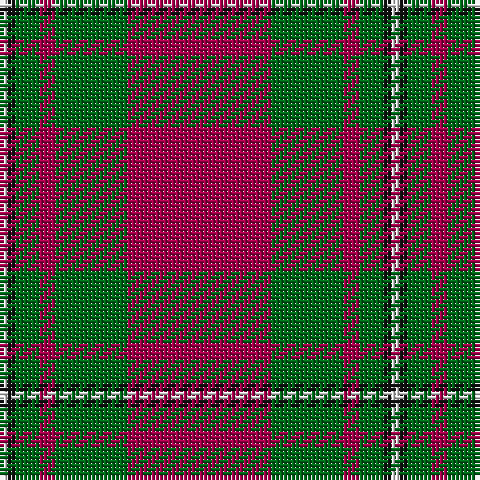

The parent of this is [MacGregor of Cardney - 1930 (Clan)](/tartans/ln/2/k2/g6/r4/g18/r/36/)

This was sourced from tartans-authority.  It is a [6 stripes tartan](/stripes/stripes6/).

Original link http://www.tartansauthority.com/tartan-ferret/display/1285/

## Thread count
LN/2 K2 G6 R4 G18 R/36

## Palette
Each colour and its ΔE from the base-6 reference it is a variant of.

| Colour | Shade | Base | ΔE (OKLab) |
|---|---|---|---|
| G |  `#006818` | G  | 0.02 |
| K |  `#101010` | K  | 0.17 |
| LN |  `#E0E0E0` | W  | 0.06 |
| R |  `#A00048` | R  | 0.11 |

# Sample pattern

ID: /variants/ln/2/k2/g6/r4/g18/r/36-g006818-k101010-lne0e0e0-ra00048/
