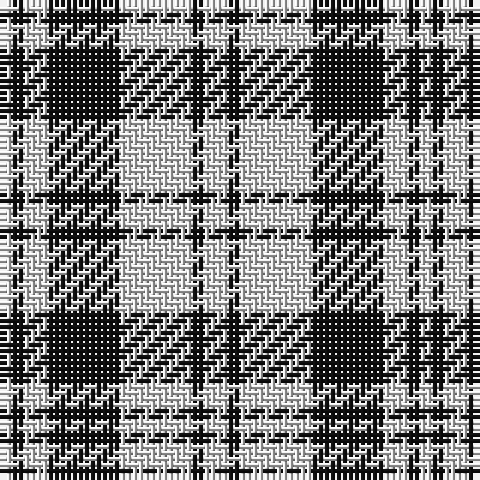

The parent of this is [Scott (Abbreviated)](/tartans/ln/2/k2/ln4/k12/ln12/k2/ln/4/)

This was sourced from register-of-tartans.  It is a [7 stripes tartan](/stripes/stripes7/).

Original link https://www.tartanregister.gov.uk/tartanDetails.aspx?ref=3690

## Thread count
LN/2 K2 LN4 K12 LN12 K2 LN/4

## Palette
Each colour and its ΔE from the base-6 reference it is a variant of.

| Colour | Shade | Base | ΔE (OKLab) |
|---|---|---|---|
| K |  `#101010` | K  | 0.17 |
| LN |  `#E0E0E0` | W  | 0.06 |

# Sample pattern

ID: /variants/ln/2/k2/ln4/k12/ln12/k2/ln/4-k101010-lne0e0e0/
