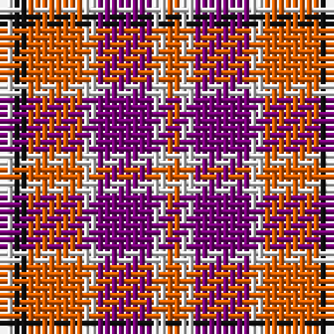

The parent of this is [Tartan Tangerine (Corporate)](/tartans/ln/2/k2/o8/ln2/p8/ln2/o/2/)

This was sourced from tartans-authority.  It is a [7 stripes tartan](/stripes/stripes7/).

Original link http://www.tartansauthority.com/tartan-ferret/display/4014/

## Thread count
LN/2 K2 O8 LN2 P8 LN2 O/2

## Palette
Each colour and its ΔE from the base-6 reference it is a variant of.

| Colour | Shade | Base | ΔE (OKLab) |
|---|---|---|---|
| K |  `#101010` | K  | 0.17 |
| LN |  `#E0E0E0` | W  | 0.06 |
| O |  `#E86000` | R  | 0.14 |
| P |  `#780078` | B  | 0.16 |

# Sample pattern

ID: /variants/ln/2/k2/o8/ln2/p8/ln2/o/2-k101010-lne0e0e0-oe86000-p780078/
