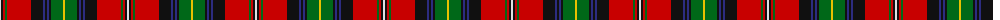

The parent of this is [Boyd Clan Tartan Tartan Number: 1819. Earliest known date: 1956 This sett is taken from a sample in the Scottish Tartans Society collection. It is a more compact form of the sett designed for Lord Kilmarnock in 1956 and registered with the Lord Lyon. The Lordship of Boyd was created in 1454. The family has a long association with the town of Kilmarnock and the castle of Dean, in the South West of Scotland. Thomas Boyd was created Earl of Arran in 1467. The tartan is based on the Hay and the Stuart of Bute tartans. See products available Copyright © Blair Urquhart, Comrie, 2015](/tartans/ln/2/k2/r2/g2/r24/k12/db2/k2/db2/k2/g12/y/2/)

This was sourced from house-of-tartan.  It is a [12 stripes tartan](/stripes/stripes12/).

Original link http://www.house-of-tartan.scotland.net/house/TartanViewjs.asp?colr=Def&tnam=1819

## Thread count
LN/2 K2 R2 G2 R24 K12 DB2 K2 DB2 K2 G12 Y/2

## Palette
Each colour and its ΔE from the base-6 reference it is a variant of.

| Colour | Shade | Base | ΔE (OKLab) |
|---|---|---|---|
| DB |  `#2C2C80` | B  | 0.05 |
| G |  `#006818` | G  | 0.02 |
| K |  `#101010` | K  | 0.17 |
| LN |  `#E0E0E0` | W  | 0.06 |
| R |  `#C80000` | R  | 0.00 |
| Y |  `#E8C000` | Y  | 0.00 |

ID: /variants/ln/2/k2/r2/g2/r24/k12/db2/k2/db2/k2/g12/y/2-db2c2c80-g006818-k101010-lne0e0e0-rc80000-ye8c000/
