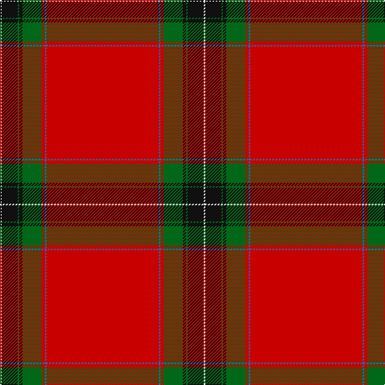

The parent of this is [Zamzam (Personal)](/tartans/ln/2/k20/g2/k4/g24/r4/b2/r/140/)

This was sourced from tartans-authority.  It is a [8 stripes tartan](/stripes/stripes8/).

Original link http://www.tartansauthority.com/tartan-ferret/display/7788/

## Thread count
LN/2 K20 G2 K4 G24 R4 B2 R/140

## Palette
Each colour and its ΔE from the base-6 reference it is a variant of.

| Colour | Shade | Base | ΔE (OKLab) |
|---|---|---|---|
| B |  `#1474B4` | B  | 0.15 |
| G |  `#006818` | G  | 0.02 |
| K |  `#101010` | K  | 0.17 |
| LN |  `#E0E0E0` | W  | 0.06 |
| R |  `#C80000` | R  | 0.00 |

# Sample pattern

ID: /variants/ln/2/k20/g2/k4/g24/r4/b2/r/140-b1474b4-g006818-k101010-lne0e0e0-rc80000/
