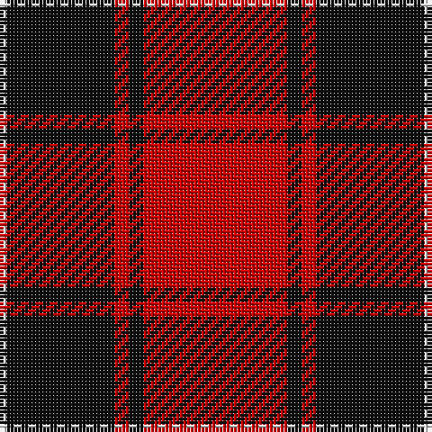

The parent of this is [Masai Shuka 15 (Artefact)](/tartans/ln/2/k30/r4/k4/r/40/)

This was sourced from tartans-authority.  It is a [5 stripes tartan](/stripes/stripes5/).

Original link http://www.tartansauthority.com/tartan-ferret/display/7211/

## Thread count
LN/2 K30 R4 K4 R/40

## Palette
Each colour and its ΔE from the base-6 reference it is a variant of.

| Colour | Shade | Base | ΔE (OKLab) |
|---|---|---|---|
| K |  `#101010` | K  | 0.17 |
| LN |  `#E0E0E0` | W  | 0.06 |
| R |  `#C80000` | R  | 0.00 |

# Sample pattern

ID: /variants/ln/2/k30/r4/k4/r/40-k101010-lne0e0e0-rc80000/
