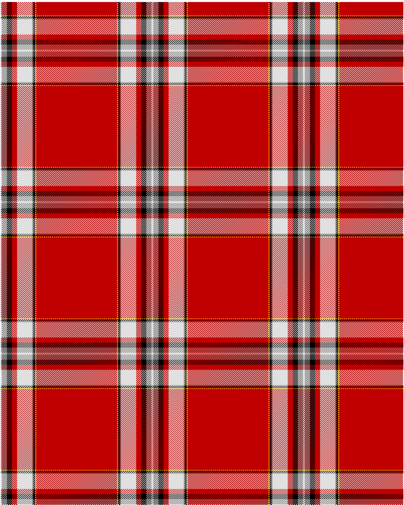

The parent of this is [Drummond of Perth, dress](/tartans/ln/2/n10/k10/r10/ln30/n2/k4/y2/r/80/)

This was sourced from <no value>.  It is a [9 stripes tartan](/stripes/stripes9/).

Original link http://www.weddslist.com/cgi-bin/tartans/pg.pl?source=sts

## Thread count
LN/2 N10 K10 R10 LN30 N2 K4 Y2 R/80

## Palette
K LN N R Y

# Sample pattern

ID: /variants/ln/2/n10/k10/r10/ln30/n2/k4/y2/r/80-k000000-lne0e0e0-n808080-rc00000-yf0c000/