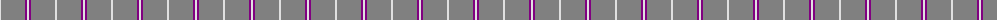
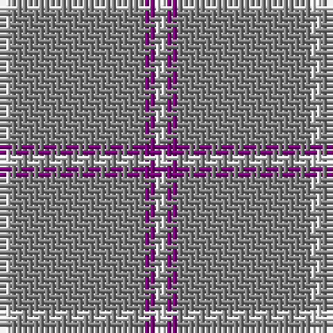

The parent of this is [Lochnagar](/tartans/ln/2/n2/n8/n14/p2/ln/2/)

This was sourced from weddslist.  It is a [6 stripes tartan](/stripes/stripes6/).

Original link http://www.weddslist.com/cgi-bin/tartans/pg.pl?source=sts

## Thread count
LN/2 N2 N8 N14 P2 LN/2

## Palette
Each colour and its ΔE from the base-6 reference it is a variant of.

| Colour | Shade | Base | ΔE (OKLab) |
|---|---|---|---|
| LN |  `#E0E0E0` | W  | 0.06 |
| N |  `#808080` | G  | 0.22 |
| P |  `#800080` | B  | 0.17 |

# Sample pattern

ID: /variants/ln/2/n2/n8/n14/p2/ln/2-lne0e0e0-n808080-p800080/
