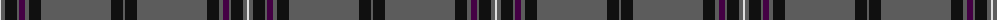

The parent of this is [Melrose Newbigging Grey (Name)](/tartans/ln/2/n4/k12/n2/dp6/n4/k12/n70/k12/n/2/)

This was sourced from tartans-authority.  It is a [10 stripes tartan](/stripes/stripes10/).

Original link http://www.tartansauthority.com/tartan-ferret/display/10500/

## Thread count
LN/2 N4 K12 N2 DP6 N4 K12 N70 K12 N/2

## Palette
Each colour and its ΔE from the base-6 reference it is a variant of.

| Colour | Shade | Base | ΔE (OKLab) |
|---|---|---|---|
| DP |  `#440044` | B  | 0.17 |
| K |  `#101010` | K  | 0.17 |
| LN |  `#E0E0E0` | W  | 0.06 |
| N |  `#5C5C5C` | B  | 0.14 |

ID: /variants/ln/2/n4/k12/n2/dp6/n4/k12/n70/k12/n/2-dp440044-k101010-lne0e0e0-n5c5c5c/
